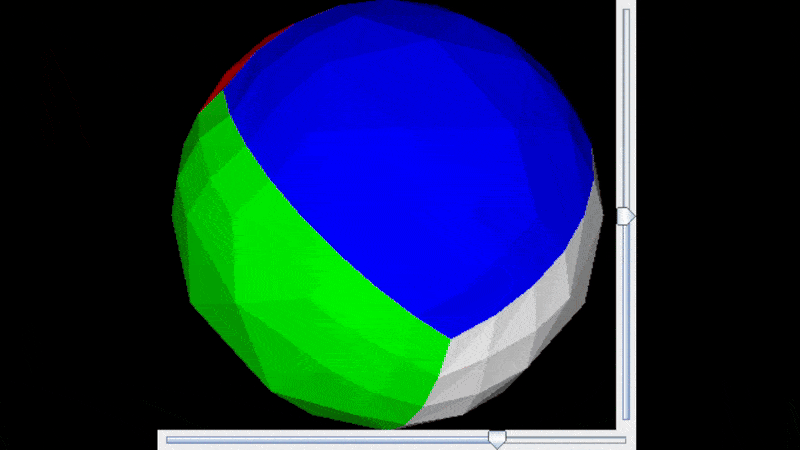

# 3D Renderer
A Java-based 3D rendering engine that implements basic 3D graphics techniques to render and manipulate a 3D object in real-time.


## Requirements

Java Development Kit (JDK) 8 or higher
Swing library (included in standard JDK)

Running the Application

Clone the repository
Compile the Java files:
```
javac *.java
```

Run the DemoViewer class:
```
java .\src\DemoViewer.java
```

## Features

- Real-time 3D rendering with interactive controls
- 3D matrix transformations for rotation and perspective
- Triangle-based mesh rendering 
- Z-buffer implementation for correct depth ordering 
- Barycentric coordinate calculation for triangle filling 
- Lighting simulation with normal vector calculation 
- Dynamic mesh subdivision for smooth spherical objects

# Technical Implementation
## Core Components

- **Matrix3D**: Handles 3D matrix operations and transformations
- **Vertex**: Represents 3D coordinates in space
- **Triangle**: Defines triangular faces with vertices and color
- **DemoViewer**: Main rendering engine and UI display

## Rendering Pipeline

1. **Object Definition**: Define 3D objects as a collection of triangles
2. **Mesh Refinement**: Subdivide triangles to create smoother surfaces
3. **Transformation**: Apply rotation matrices to the 3D object
4. **Projection**: Convert 3D coordinates to 2D screen space
5. **Rasterization**: Fill triangles using barycentric coordinates
6. **Z-buffering**: Determine visible pixels based on depth
7. **Lighting**: Calculate shading based on surface normals
8. **Display**: Render the final image to the screen

## Mathematical Techniques

- Matrix Multiplication: For applying transformations
- Vector Normalization: For light calculations
- Barycentric Coordinates: For triangle rasterization
- Normal Vector Calculation: For determining surface orientation

## Controls

- Horizontal Slider: Controls rotation around the vertical axis (heading)
- Vertical Slider: Controls rotation around the horizontal axis (pitch)


